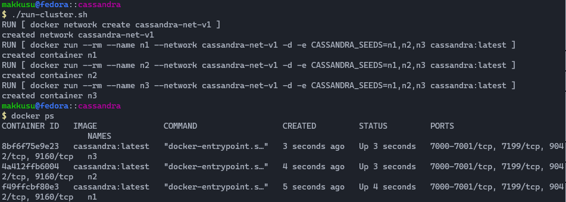
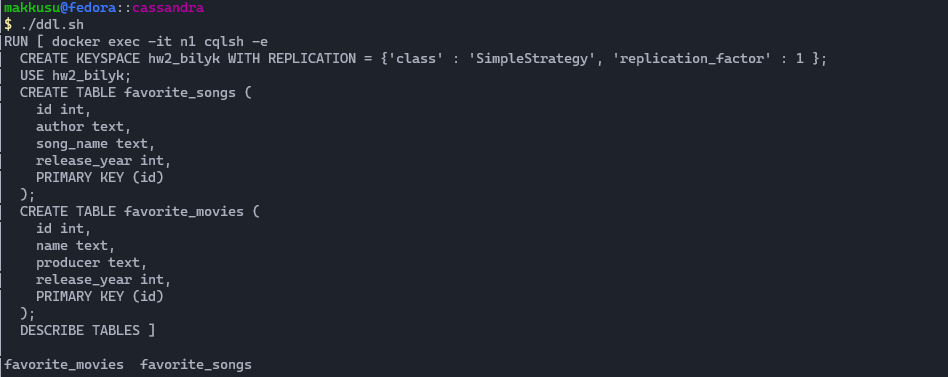
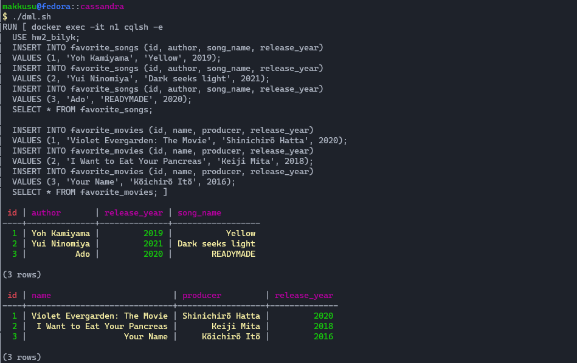
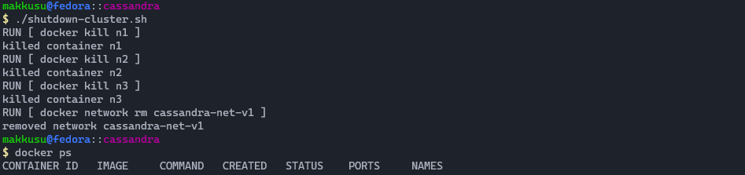
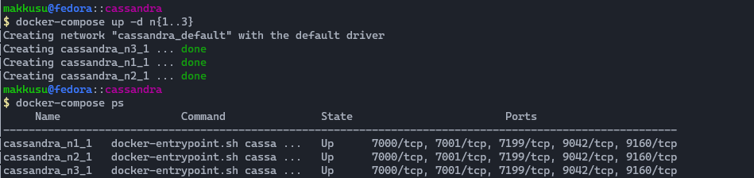
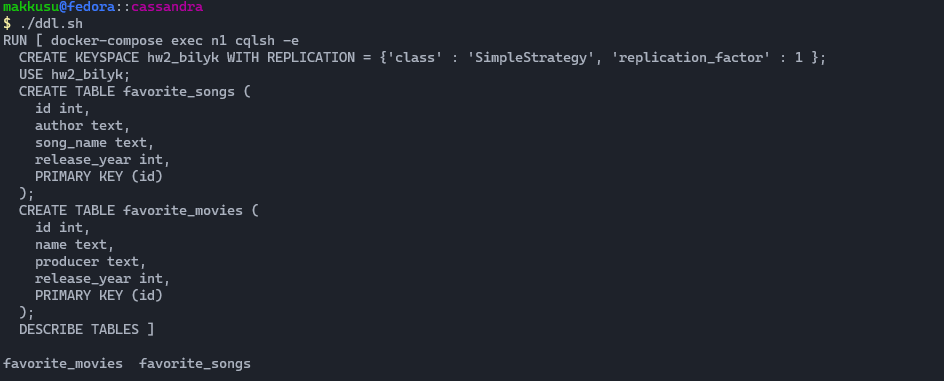
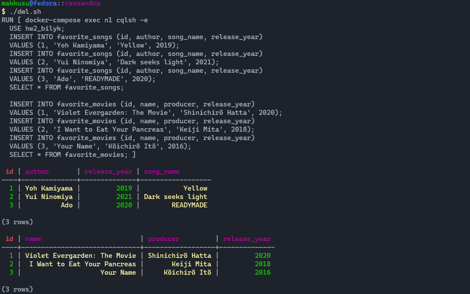
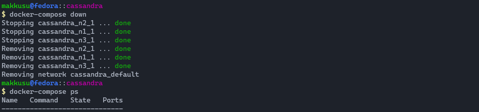

# Lab II: Introduction to cassandra


### Requirements
- bash
- docker


### Setup
-   ```bash
    git clone https://github.com/mak9su4roi/big-data-2022
    ```
-   ```bash
    chmod -R +x ./big-data-2022/l_02_intro_to_cassandra/
    ```
-   ```bash
    cd ./big-data-2022/l_02_intro_to_cassandra
    ```

### Without docker-compose
-   ```bash
    ./run-cluster.sh
    ```
    
-   ```bash
    ./ddl.sh
    ```
    
-   ```bash
    ./dml.sh
    ```
    
-   ```bash
    ./shutdown-cluster.sh
    ```
    

### With docker-compose
-   ```bash
    docker-compose up -d n{1..3}
    ```
    
-   ```bash
    ./ddl.sh
    ```
    
-   ```bash
    ./dml.sh
    ```
    
-   ```bash
    docker-compose down
    ```
    
