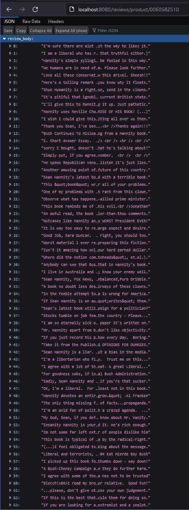
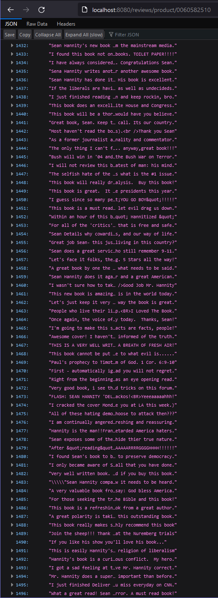
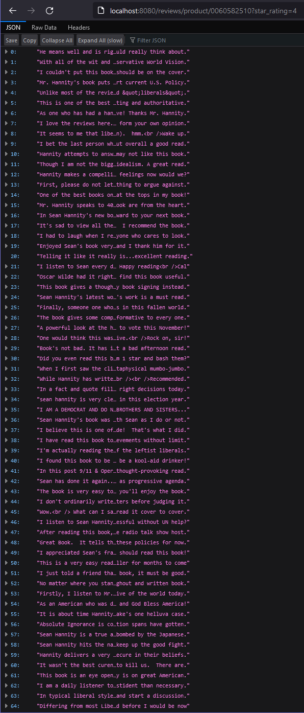
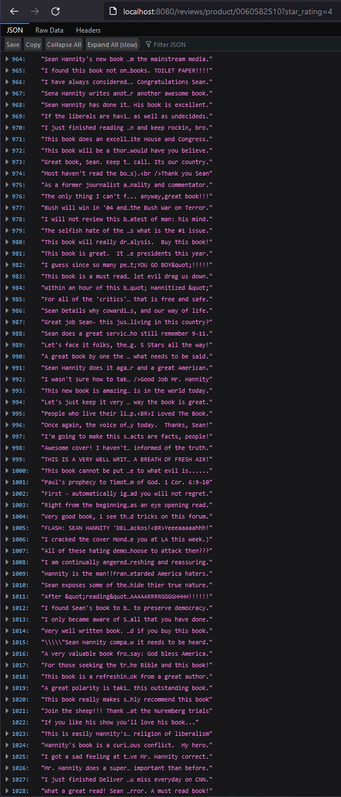
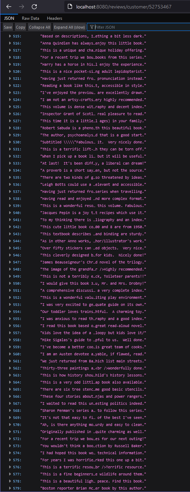
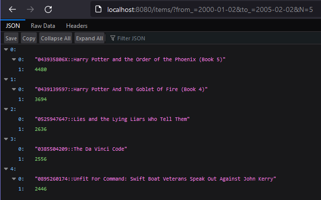
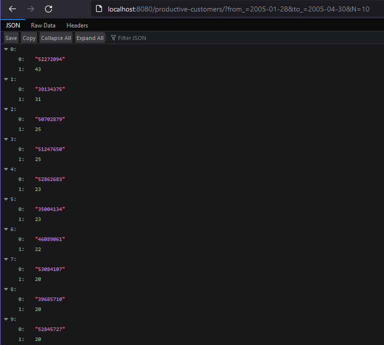
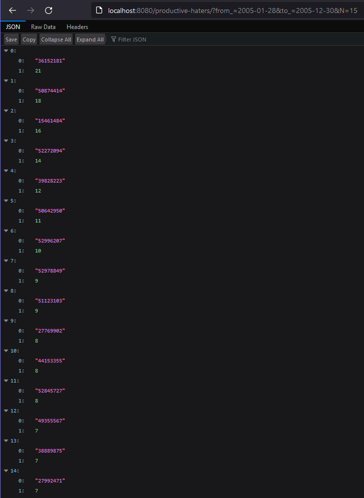
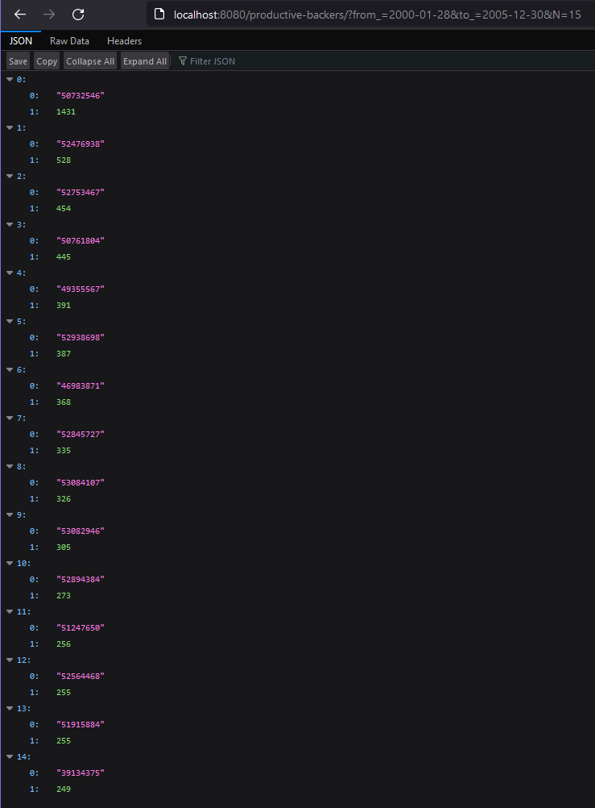

# Lab IV: Cassandra using driver

- [Script for creating tables](./node/ddl.cql)
- [REST API source code](./api.py)
- [Dockerfile for REST API](./api/dockerfile)
- [Dataset loader source code](./loader.py)
- [Script for launching project](./run.sh)
- [Script for clean-up](./stop.sh)

## Requirements
- [amazon_reviews_us_Books_v1_02.tsv](https://s3.amazonaws.com/amazon-reviews-pds/tsv/amazon_reviews_us_Books_v1_02.tsv.gz)

## Setup

-   ```bash
    git clone https://github.com/mak9su4roi/big-data-2022
    ```
-   ```bash
    chmod -R +x ./big-data-2022/l_04_cassandra_using_driver
    ```
-   ```bash
    cd ./big-data-2022/l_04_cassandra_using_driver
    ```

## Columns 

- `customer_id` -- random identifier that can be used to aggregate reviews written by a single author. 
- `product_id` -- the unique Product ID the review pertains to.
- `start_rating` -- the 1-5 star rating of the review.
- `review_id` -- the unique ID of the review.
- `review_body` -- the review text.
- `review_date` -- YY-MM-DD timestamp indicating when review was given.
- `year` -- YY timestamp indicating when review was given.
- `all_reviews` -- the number of reviews for certain product (`product_id`) written on certain day (`review_date`)
- `ver_reviews` -- the number of reviews written for verified purchases on certain day (`review_date`) by specific customer (`customer_id`)
- `pos_reviews` -- the number of positive reviews written on certain day (`review_date`) by specific customer (`customer_id`)
- `neg_reviews` -- the number of negative reviews written on certain day (`review_date`) by specific customer (`customer_id`)
- `product` -- concatenation of `product_id` with `product_title`

## Design of Tables per Query

- `review_body_by_product_id_and_star_rating`

| column_name | data_type | column_type |
| ----------- | --------- | ----------- |
| product_id  | text      | K           |
| star_rating | int       | C(ASC)      |
| review_id   | text      | C(ASC)      |
| review_body | text      |             |

- `review_body_by_customer_id`

| column_name | data_type | column_type |
| ----------- | --------- | ----------- |
| customer_id | text      | K           |       
| review_id   | text      | C(ASC)      |
| review_body | text      |             |

- `all_reviews_by_time_period`

| column_name | data_type | column_type |
| ----------- | --------- | ----------- |
| year        | int       | K           |
| review_date | timestamp | C(ASC)      |
| product     | text      | C(ASC)      |
| all_reviews | int       |             |


- `ver_pos_neg_reviews_by_time_period`

| column_name | data_type | column_type |
| ----------- | --------- | ----------- |
| year        | int       | K           |  
| review_date | timestamp | C(ASC)      |     
| customer_id | text      | C(ASC)      | 
| ver_reviews | int       |             | 
| pos_reviews | int       |             | 
| neg_reviews | int       |             | 

---
## Launch Node & Loader & API
### With script
```bash
export DATASET=amazon_reviews_us_Books_v1_02
./run.sh
```
### With docker-compose
```bash
export DATASET=amazon_reviews_us_Books_v1_02
docker-compose up -d api
```

## Stop Node & API
### With script
```bash
./stop.sh
```
### With docker-compose
```bash
docker-compose down
```

---
## Querry Examples
1. Return all reviews for specified `product_id`
    1. 
    2. 
2. Return all reviews for specified `product_id` with given `star_rating`
    1. 
    2. 
3. Return all reviews for specified `customer_id`
    1. 
    2. 
4. Return N most reviewed items (by # of reviews) for a given period of time
    1. 
5. Return N most productive customers (by # of reviews written for verified purchases) for a given period
    1. 
6. Return N most productive “haters” (by # of 1- or 2-star reviews) for a given period
    1. 
7. Return N most productive “backers” (by # of 4- or 5-star reviews) for a given period
    1. 