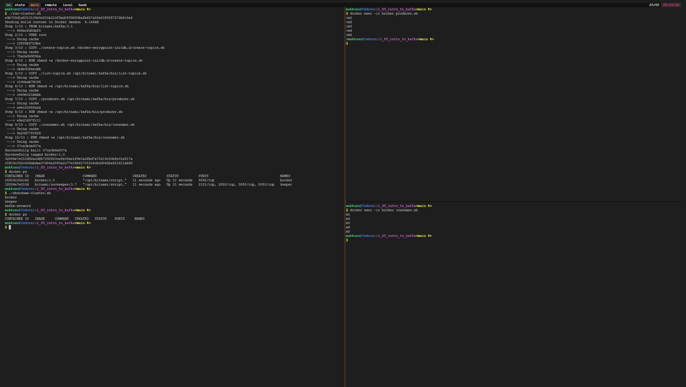

# Lab II: Introduction to cassandra


### Requirements
- bash
- docker


### Setup
-   ```bash
    git clone https://github.com/mak9su4roi/big-data-2022
    ```
-   ```bash
    chmod -R +x ./big-data-2022/l_05_intro_to_kafka/
    ```
-   ```bash
    cd ./big-data-2022/l_05_intro_to_kafka/
    ```

### Without docker-compose


### With docker-compose

