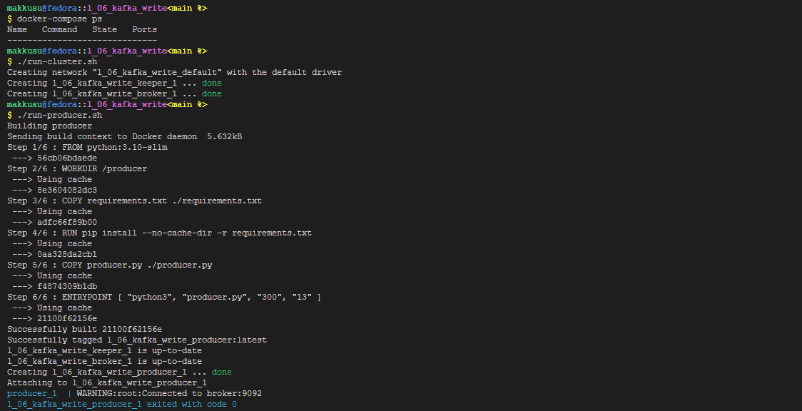
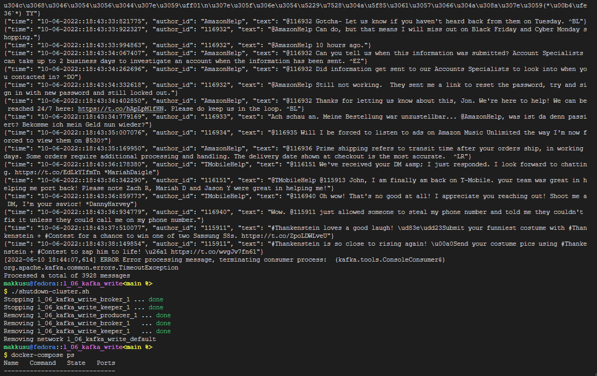

# Lab VI: Write into Kafka

### Requirements
- bash
- docker
- docker-compose
- twitts to stream: `.l_06_kafka_write/twcs/twcs.csv`

### Setup
-   ```bash
    git clone https://github.com/mak9su4roi/big-data-2022
    ```
-   ```bash
    chmod -R +x ./big-data-2022/l_06_kafka_write/
    ```
-   ```bash
    cd ./big-data-2022/l_06_kafka_write/
    ```

### Instructions
-   Create cluster
    ```bash
    docker-compose ps
    ./run-cluster.sh
    ```
-   Run producer
    ```bash
    ./run-producer.sh
    ```
-   

-   Run consumer
    ```bash
    ./run-consumer.sh
    ```
-   Shutdown cluster
    ```bash
    ./shutdown-cluster.sh
    ```
-   
