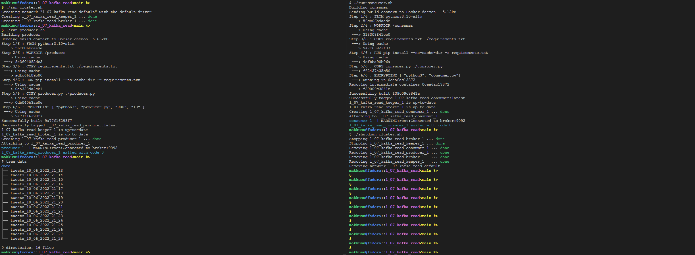
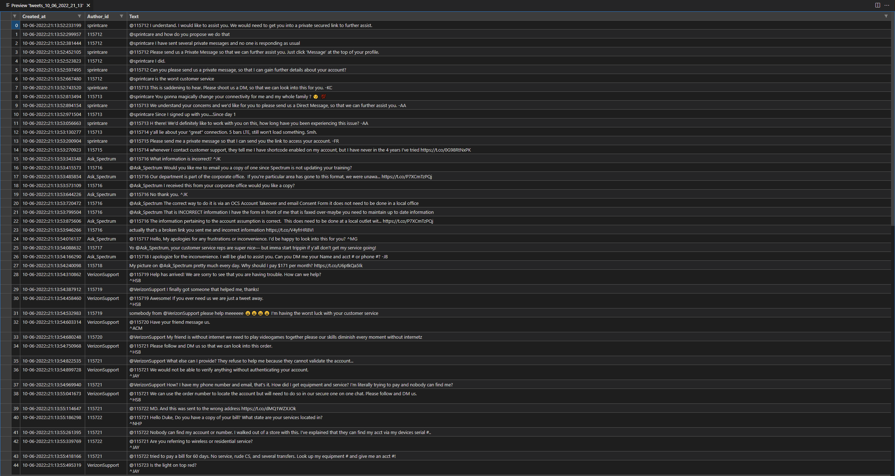
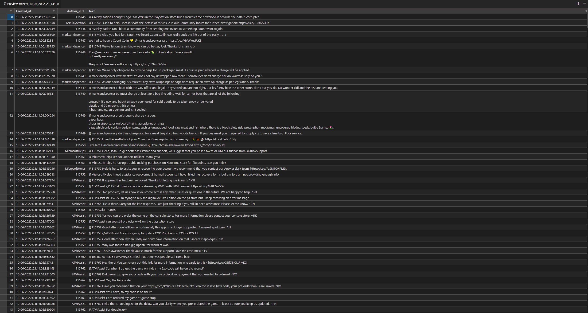

# Lab VII: Read into Kafka

### Requirements
- bash
- docker
- docker-compose
- twitts to stream: `.l_07_kafka_read/twcs/twcs.csv`

### Setup
-   ```bash
    git clone https://github.com/mak9su4roi/big-data-2022
    ```
-   ```bash
    chmod -R +x ./big-data-2022/l_07_kafka_read/
    ```
-   ```bash
    cd ./big-data-2022/l_07_kafka_read/
    ```

### Instructions
-   Create cluster
    ```bash
    docker-compose ps
    ./run-cluster.sh
    ```
-   Run producer & consumer
    ```bash
    ./run-producer.sh
    ```
    ```bash
    ./run-consumer.sh
    ```
-   Display `data` dir
    ```bash
    tree data
    ```
-   Shutdown cluster
    ```bash
    ./shutdown-cluster.sh
    ```
-   
-   Show `tweets_10_06_2022_21_13`
-   
-   Show `tweets_10_06_2022_21_14`
-   
