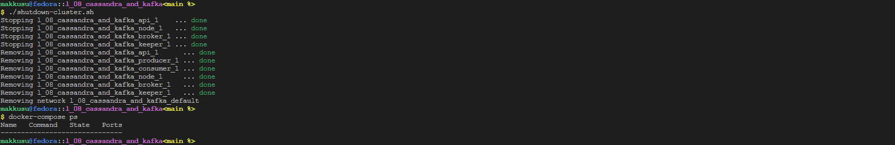

# Lab VIII: Cassandra and Kafka

### Requirements
- `bash`
- `docker`
- `docker-compose`
- `jq` -- for beatiful json output 
- transactions to stream: `l_08_cassandra_and_kafka/PS_20174392719_1491204439457_log.csv`

### Setup
-   ```bash
    git clone https://github.com/mak9su4roi/big-data-2022
    ```
-   ```bash
    chmod -R +x ./big-data-2022/l_08_cassandra_and_kafka/
    ```
-   ```bash
    cd ./big-data-2022/l_08_cassandra_and_kafka/
    ```

### Instructions
-   Create cassandra cluster & kafka cluster
    ```bash
    ./run-cassandra-cluster.sh
    ./run-kafka-cluster.sh
    ```
-   Run producer & consumer
    ```bash
    ./run-producer.sh
    ```
    ```bash
    ./run-consumer.sh
    ```
-   Wait for a while... See logs
    ```bash
    docker-compose logs -t producer
    docker-compose logs -t consumer | head
    docker-compose logs -t consumer | tail
    ```
-   

-   Launch API
    ```bash
    ./run-api.sh
    ```
-   Run testing scripts
    ```bash
    ./test.sh
    ```
-   

-   Wathch status of container
    ```
    docker-compose ps
    ```
-   

-   Shutdown whole cluster
-   ```bash
    ./shutdown-cluster.sh
    docker-compose ps
    ```
-   
