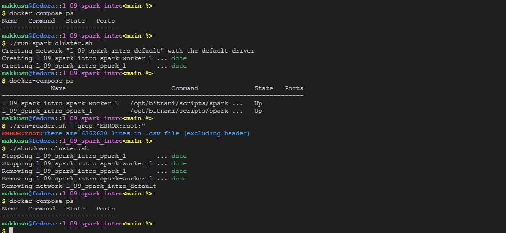

# Lab IX: Introduction to Spark

### Requirements
- `bash`
- `docker`
- `docker-compose`
- transactions dataset: `l_09_spark_intro/PS_20174392719_1491204439457_log.csv`

### Setup
-   ```bash
    git clone https://github.com/mak9su4roi/big-data-2022
    ```
-   ```bash
    chmod -R +x ./big-data-2022/l_09_spark_intro/
    ```
-   ```bash
    cd ./big-data-2022/l_09_spark_intro
    ```

### Instructions
-   Create Spark cluster -> Run application -> Shutdown Spark cluster
    ```bash
    docker-compose ps
    ```
    ```bash
    ./run-spark-cluster.sh
    ```
    ```bash
    docker-compose ps
    ```
    ```bash
    ./run-reader.sh | grep "ERROR:root:"
    ```
    ```bash
    ./shutdown-cluster.sh
    ```
    ```bash
    docker-compose ps
    ````
-   